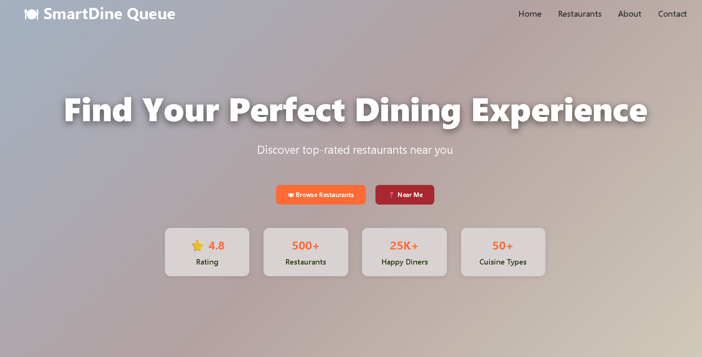
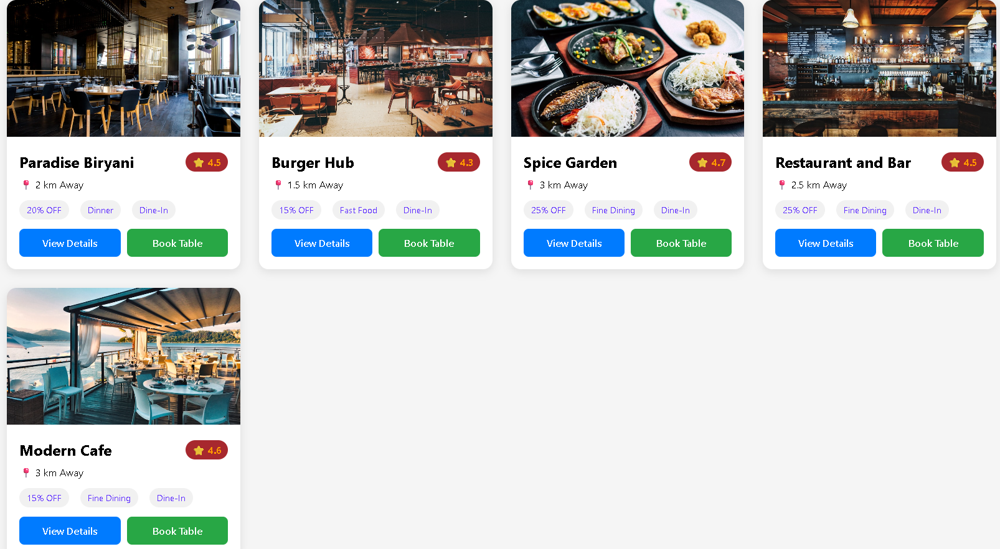
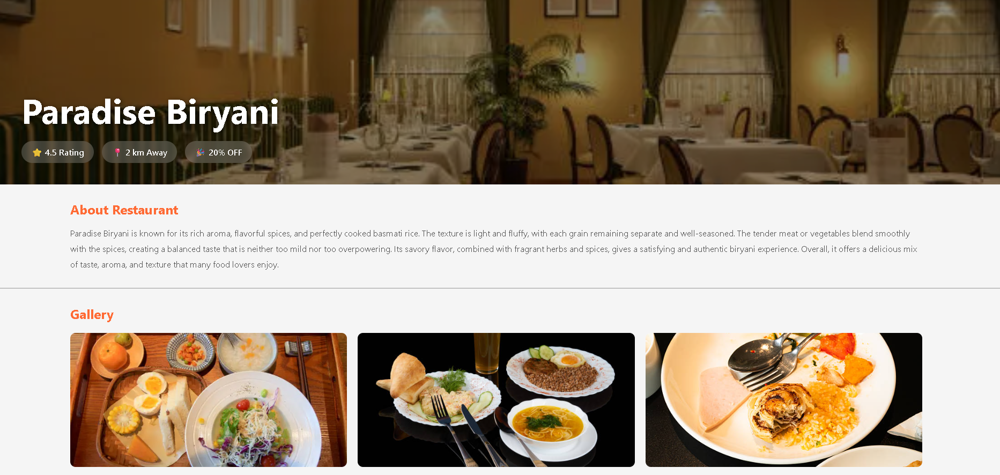
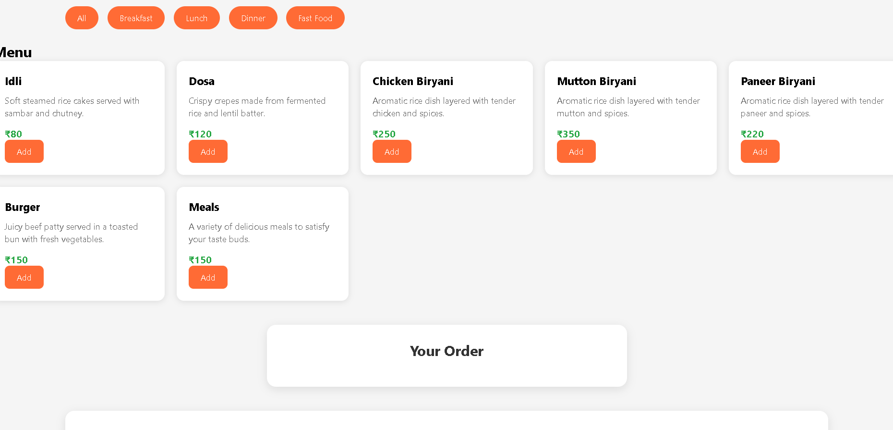
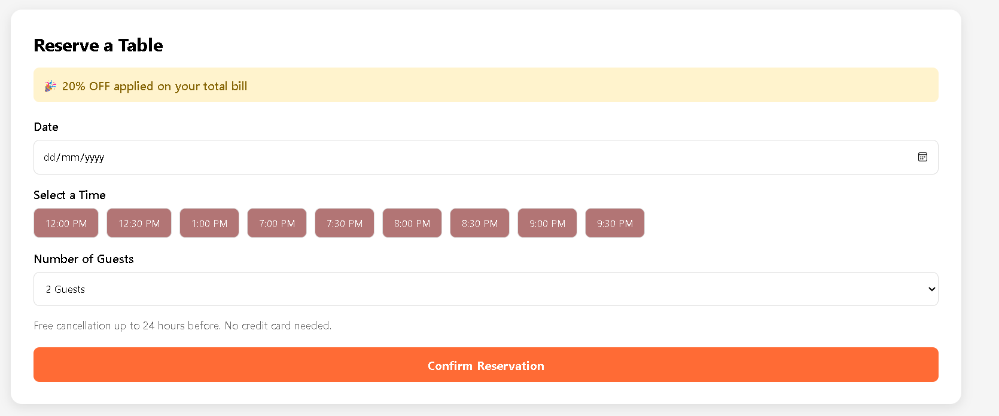
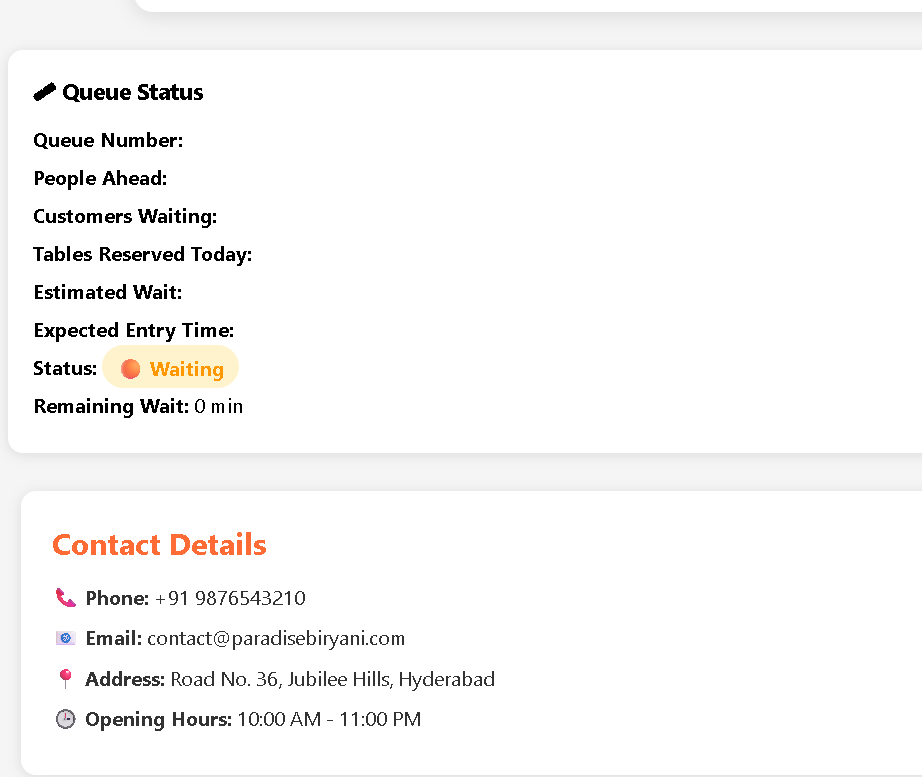
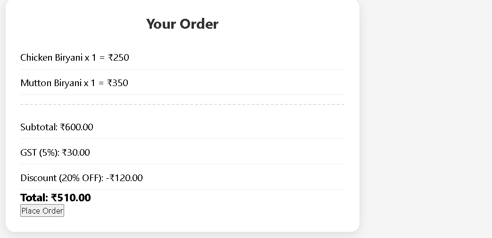

# 🍽️ SmartDineQueue System

SmartDineQueue is a smart restaurant reservation and queue management web application that enhances the dining experience by allowing customers to reserve tables, pre-order food, and monitor their live queue status before arriving at the restaurant.

The system helps reduce waiting time, improves restaurant efficiency, and provides customers with a seamless dining experience.

---

## 🚀 Features

### 🪑 Table Reservation
- Reserve a table online before visiting the restaurant.
- Select the number of guests.
- Select the time and date.
- Receive a confirmation after successful booking.

### 🍔 Food Pre-Ordering
- Browse the restaurant menu.
- Add food items to the cart.
- Place food orders before arriving.
- Reduce waiting time after reaching the restaurant.

### ⏳ Smart Queue Management
- Automatically generates a unique queue number.
- Displays customer's current position in the queue.
- Shows estimated waiting time.
- Live countdown timer for table availability.
- Queue status updates:
  - 🟠 Waiting
  - 🟢 Table Ready
  - 🔵 Seated

### 🔔 Notifications
- Friendly pop-up notifications for booking confirmation.
- Alert when the table is ready.
- Reminder to reach the restaurant within the specified time.

### 📱 Responsive Design
- Mobile-friendly interface.
- Works on desktops, tablets, and smartphones.

---

## 🛠️ Technologies Used

- HTML5
- CSS3
- JavaScript
- Local Storage (for storing reservation data)

---

## 📂 Project Structure

## 📂 Project Structure

```text
SmartDine-Queue/
│
├── css/
│   └── style.css
│
├── images/
│
├── js/
│   └── script.js
│
├── screenshots/
│
├── index.html
├── booking.html
├── burger-hub.html
├── paradise-biryani.html
│
└── README.md
```

---

## 💡 How It Works

1. **Visit the SmartDineQueue Website**
   - Users open the SmartDineQueue web application.

2. **Find a Restaurant**
   - Users can search for a restaurant by name.
   - Alternatively, they can browse nearby restaurants within a 5 km radius based on their current location.

3. **Choose a Restaurant**
   - After selecting a restaurant, users have two options:
     - **View Restaurant Details** to check information such as menu, ratings, location, opening hours, and facilities.
     - **Book a Table** directly without viewing additional details.

4. **Reserve a Table**
   - Users enter their reservation details, including the number of guests, preferred date, and time.
   - If a table is available, the reservation is confirmed.

5. **(Optional) Pre-Order Food**
   - After booking a table, users may choose to browse the menu and pre-order food before arriving at the restaurant.
   - Pre-ordering is optional and helps reduce waiting time for meal preparation.

6. **Queue Generation**
   - Once the reservation is confirmed, the system automatically assigns a unique queue number and adds the customer to the waiting queue.

7. **Track Queue Status**
   - Users can view:
     - Queue Number
     - Current Queue Position
     - Estimated Waiting Time
     - Live Countdown Timer
     - Queue Status (Waiting, Table Ready, or Seated)

8. **Receive Notifications**
   - When the table is ready, the system notifies the user and requests them to arrive at the restaurant within the specified time.

9. **Enjoy the Dining Experience**
   - Upon arrival, the customer is seated. If they pre-ordered food, the restaurant can begin preparing or serving it with minimal delay.

## 🎯 Objectives

- Minimize restaurant waiting time.
- Improve customer satisfaction.
- Simplify restaurant table management.
- Enable convenient online food pre-ordering.
- Provide real-time queue tracking.

---


## 📸 Project Screenshots

## 🏠 Home Page

<p align="center">
  
  
</p>

## 🍽️ Restaurant Details

<p align="center">
  
</p>

## 🍕 Food Ordering

<p align="center">
  
</p>

## 🪑 Table Reservation

<p align="center">
  
</p>

## ⏳ Queue Management

<p align="center">
  
</p>

## 💳 Bill Summary


<p align="center">
  
</p>
---

## 🔮 Future Enhancements

- User Login & Registration
- Restaurant Admin Dashboard
- Payment Gateway Integration
- QR Code for Reservations
- Live Order Tracking
- SMS & Email Notifications
- Google Maps Navigation
- AI-based Waiting Time Prediction

---

## 👨‍💻 Author

**Ummeda Srinidhi**

Graduation Project

---

## 📄 License

This project is developed for educational and academic purposes.

Feel free to use and modify it for learning purposes.